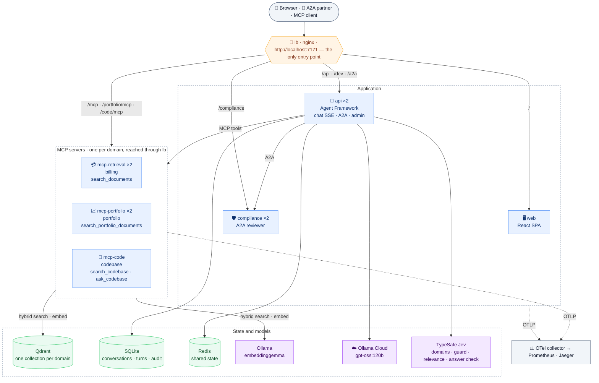

# maf-lab

[](https://github.com/petarnenov/maf-lab/actions/workflows/ci.yml)

A learning lab: a RAG-backed assistant for a TAMP, over three domains — **billing**, **portfolio** and the lab's own
**codebase** — each served by its own **MCP server** with its own retrieval **tool** (`search_documents`,
`search_portfolio_documents`, `search_codebase`) over its own **multi-tenant Qdrant** collection, consumed by a **Microsoft Agent Framework** agent, with a React chat UI, an eval
harness and tested prompt-injection defences. TypeSafe's Jev decides which domains a question belongs to, and the
monitor shows where a turn crosses from one into the other.

<picture>
  <source media="(prefers-color-scheme: dark)" srcset="docs/screenshots/chat-dark.png">
  
</picture>

- Stack, layout and hard conventions: [`openspec/project.md`](openspec/project.md)
- Why things are the way they are, and every pinned version: [`DECISIONS.md`](DECISIONS.md)
- Current behaviour (specs): [`openspec/specs`](openspec/specs); every change that built it, in
  [`openspec/changes/archive`](openspec/changes/archive) — from
  [`add-day3-retrieval`](openspec/changes/archive/2026-09-19-add-day3-retrieval) and `add-load-balancer` to
  `add-portfolio-domain`, `add-compliance-agent`, `use-jev-intent-classifier` and `add-codebase-domain`
- HTTP contract between API and web: [`docs/http-api.md`](docs/http-api.md); the trace event format:
  [`docs/trace-events.md`](docs/trace-events.md); telemetry: [`docs/telemetry.md`](docs/telemetry.md); shared state:
  [`docs/shared-state.md`](docs/shared-state.md)
- Screens: `/chat`, `/evals`, `/topology`, `/telemetry`, `/curriculum`, and for admins `/admin/index`, `/admin/feedback`,
  `/admin/compliance`, `/admin/jev`, `/admin/a2a`



Everything user- and agent-facing goes through **one entry point on port 7171**. api, mcp-retrieval, mcp-portfolio and
compliance run two replicas each, mcp-code one (`X-Instance` response header shows which one answered). The balancer
also serves Jaeger at `/jaeger` and takes the browser's OTLP traces at `/v1/traces`. Only Qdrant and Ollama are
published besides 7171.

The balancer's routes, as `compose/lb/nginx.conf` declares them:

<!-- generated:lb-routes — edit compose/lb/nginx.conf, then run make docs -->
| Path | Match | Served by |
|---|---|---|
| `/lb-health` | exact | the balancer itself |
| `/api/chat` | exact | `api` |
| `/api/` | prefix | `api` |
| `/dev/` | prefix | `api` |
| `/.well-known/agent-card.json` | exact | `api` |
| `/a2a` | prefix | `api` |
| `/mcp` | exact | `mcp-retrieval` |
| `/portfolio/mcp` | exact | `mcp-portfolio` at `/mcp` |
| `/code/mcp` | exact | `mcp-code` at `/mcp` |
| `/compliance` | prefix | `compliance` |
| `/v1/traces` | prefix | `otel-collector` |
| `/jaeger` | prefix | `jaeger` |
| `/` | prefix | `web` |
<!-- /generated:lb-routes -->

<table>
<tr>
<td width="50%" valign="top">
<picture>
  <source media="(prefers-color-scheme: dark)" srcset="docs/screenshots/jev-dark.png">
  
</picture>

**Jev** (`/admin/jev`): every call TypeSafe's Jev made for the firm's turns, and how often it was unavailable
</td>
<td width="50%" valign="top">
<picture>
  <source media="(prefers-color-scheme: dark)" srcset="docs/screenshots/evals-dark.png">
  
</picture>

**Evals** (`/evals`): each suite's metrics over time, against the accepted baseline
</td>
</tr>
</table>

The same picture, drawn in [`docs/topology.drawio`](docs/topology.drawio) and **live**, is at
[`/topology`](http://localhost:7171/topology): each box carries the state of that service — healthy, degraded or
unreachable — its replicas by name, and the facts that explain the lab's behaviour (chunks in the index, models,
tools offered). Edit the diagram in draw.io (save it *uncompressed*) and the page follows; a service that exists in
the report but not in the drawing fails the test suite.

<picture>
  <source media="(prefers-color-scheme: dark)" srcset="docs/screenshots/topology-dark.png">
  
</picture>

## Quick start

```bash
make setup                 # install what's missing (.NET SDK at the version global.json pins, into ~/.dotnet)
export OLLAMA_API_KEY=…    # chat runs on Ollama Cloud (gpt-oss:120b); the key is only read from the environment
export JEV_MAF_LAB=…       # intent classification runs on TypeSafe Jev; same rule
make                       # doctor-lite → build → start → wait until healthy → index if empty → http://localhost:7171
make help                  # every target
```

<!-- generated:make-targets — edit the Makefile's ## comments, then run make docs -->
| Command | What it does |
|---|---|
| `make all` | Start everything: build, run, wait for health, index if empty (default) |
| `make help` | List the targets |
| `make up` | Build and start the stack (replicas via API_REPLICAS/MCP_REPLICAS/COMPLIANCE_REPLICAS), wait until healthy |
| `make down` | Stop the stack (data volumes are kept) |
| `make restart` | Stop and start the stack |
| `make ps` | Show services, state and health |
| `make logs` | Follow logs (SERVICE=api to narrow) |
| `make clean` | Remove the stack WITH volumes (index, conversations) and build outputs; asks unless FORCE=1 |
| `make infra` | Start only the indexer's infrastructure (Qdrant, Ollama + the embedding model) and wait until healthy |
| `make index` | Index both domains' corpora and the codebase (unchanged documents are skipped) |
| `make index-portfolio` | Index the portfolio corpus (data-portfolio/ → maf_portfolio_chunks) only |
| `make index-code` | Index the repository itself (→ maf_code_chunks, served by mcp-code) only; unchanged files are skipped |
| `make reindex` | Re-embed every document of both domains (--force) |
| `make drift` | Report stale documents (source newer than index) |
| `make rebuild-index` | Re-create the collection with every configured dense vector and re-index (asks unless FORCE=1) |
| `make migrate` | Fill a provisioned dense vector with its configured model (TO=dense_v3) |
| `make test` | Run all tests (.NET unit + integration, web) |
| `make test-dotnet` | .NET tests (integration tests start Qdrant via Testcontainers) |
| `make test-web` | Web tests (Vitest) |
| `make lint` | Build .NET with warnings as errors; ESLint + Prettier for web |
| `make lint-dotnet` | .NET build with warnings as errors |
| `make lint-web` | ESLint + Prettier |
| `make build-web` | Type-check and build the web app |
| `make specs` | Validate all OpenSpec specs and changes (strict) |
| `make docs` | Rewrite the generated blocks in README, project.md, config.yaml and the Copilot instructions |
| `make docs-check` | Check the docs against the code (generated blocks, routes, make targets, models, links); changes nothing |
| `make ci` | Run locally what GitHub Actions runs on every push |
| `make ci-e2e` | Model-free end-to-end: stack with the Ollama stub, index, verify, A2A conformance, test generation (CI mode) |
| `make testgen-e2e` | Model-free test generation end to end: refresh, run, verify, accept (used by ci-e2e, against its clone) |
| `make coverage` | Refresh the coverage snapshot at main (both toolchains, through the running stack) |
| `make verify` | Verify the running stack through the load balancer (35 checks) |
| `make eval` | Run evals (SUITE=all\|selection\|retrieval\|generation\|injection\|confirmation\|intent\|domain\|presentation\|guardrail\|answer-check) against the stack's MCP servers |
| `make ask` | Ask one question through the agent and print its trace (Q="…" FIRM=firm-a), e.g. a cross-domain one |
| `make screenshots` | Re-take the README screenshots from the running stack into docs/screenshots (SHOTS=chat,topology for a subset) |
| `make eval-accept` | Run the evals and accept their metrics as the new baseline (commit the result) |
| `make eval-selection` | Eval: tool selection (recall/precision) |
| `make eval-retrieval` | Eval: retrieval (recall@5/@20, MRR per mode) |
| `make eval-generation` | Eval: answers judged for faithfulness/relevance |
| `make eval-injection` | Eval: prompt-injection pass rate |
| `make eval-confirmation` | Eval: does the summary a person approves say what would happen |
| `make eval-intent` | Eval: intent classifier alone — would each question force search_documents? (needs JEV_MAF_LAB) |
| `make eval-guardrail` | Eval: content guard alone — are malicious prompts/tool results flagged and benign ones not? (needs JEV_MAF_LAB) |
| `make eval-presentation` | Eval: do portfolio answers build on their data cards instead of restating them? |
| `make eval-answer-check` | Eval: Jev's answer check alone — are labelled unsupported answers flagged and supported ones not? (needs JEV_MAF_LAB) |
| `make eval-a2a` | Conformance: an outside client drives the agents through evals/a2a-conformance.jsonl |
| `make dev` | Run mcp/api/web locally without Docker (infra stays in compose); Ctrl-C stops |
| `make doctor` | Check prerequisites (Docker, .NET SDK, Node/npm, make, OLLAMA_API_KEY, JEV_MAF_LAB, MAF_LAB_REPO, GITHUB_ISSUES_TOKEN) |
| `make setup` | Install what 'make doctor' reports missing (.NET SDK unattended; prints the rest) |
<!-- /generated:make-targets -->

## Chat history

The left sidebar of `/chat` lists your own conversations, most recent activity first. You can search titles, questions
and answers. Open a conversation to restore every turn exactly as it looked (answers, tool cards, sources, feedback,
and the behind-the-scenes trace with time travel while it is kept), then continue it. The active conversation is in
the URL (`/chat/{id}`), so a reload reopens it. Rename or delete from the item's menu. Delete hides the conversation
and stops it being continued; its turns stay for the review queue and evals.

## Asking about the code

The repository itself is a corpus (`make index-code`). It is indexed by structure: each type and member with its doc
comment, sized under embeddinggemma's 2048-token window, and searchable by identifier as well as by meaning. Ask in the
chat, "how does the code make a tool call idempotent?" or "покажи ми дефиницията на code mcp сървъра". Jev puts the
question in the codebase domain, the turn loads only the codebase server's `search_codebase`, and the answer cites
`path:start-end`. The right pane switches to **Code snippets**, which shows exactly the snippets the answer used. For
a question that did not search the code, the tab shows related code, labelled as not used. Other MCP clients can call
`search_codebase` and `ask_codebase` at `http://localhost:7171/code/mcp` with a dev token.

<picture>
  <source media="(prefers-color-scheme: dark)" srcset="docs/screenshots/code-snippets-dark.png">
  
</picture>

## Asking in another language

The corpus is English. A question written in another language is translated into the corpus language *before* it is
embedded and before BM25 encodes it, so both halves of hybrid retrieval work on the same vocabulary as the index;
the answer still comes back in the language of the question. The monitor's Retrieval tab shows both texts, and the
retrieval eval reports recall per language. Measured over the eval set, Bulgarian recall@5 went from **0.21 to
0.68** while English stayed at 0.69. Switch it off with `Retrieval__NormalizeQueryLanguage=false`; the corpus
language is `Retrieval__CorpusLanguage` (default `en`).

## Another agent talking to this one (A2A)

The assistant is also an **[A2A 1.0](https://a2a-protocol.org) agent**, so another system can work with it without
a person in the loop. It advertises itself at `http://localhost:7171/.well-known/agent-card.json` — a signed card
naming its skills, its transports (JSON-RPC and HTTP+JSON) and how to authenticate — and answers on `/a2a`.

A partner is a **system, not a user**: its token's audience is the A2A endpoint, it carries no user identity, and
the firms it may see come from the server's `A2A:Partners` registration rather than from anything it sends. Ask
about a firm outside that set and you get one fixed sentence and no data — not the run, not whether it exists.

It can ask about a billing run, ask anything else (answered by the same agent and the same MCP tools the chat UI
uses), or **start a billing run** — which comes back as a task it can follow, resume when the agent asks for a
missing period, resubscribe to after a dropped connection, cancel, or be notified about through a webhook. That
run is **simulated**: it walks the real lifecycle over the seeded runs and bills nobody. The card says so, the
final artifact says so (`"simulated": true`), and so does this paragraph.

Two clients prove it from outside: `python3 scripts/a2a_probe.py` speaks the 1.0 wire format and imports no A2A
library at all, and `make eval-a2a` runs `tools/Maf.Lab.A2AProbe`, which builds an agent from nothing but the card
using the A2A client. The preview SDK underneath does not yet speak 1.0 on the wire; every difference and what is
done about it is in `DECISIONS.md`.

**Conformance is a dataset, run by an outside client.** `evals/a2a-conformance.jsonl` names what such a client
must be able to do — discovery, the extended card after authenticating, a direct answer, a streamed task,
resubscribing after a dropped stream, resuming a task that asked for something, cancelling, a push delivery to a
webhook it registered, and a request outside its entitlement being refused. The probe reads that file and runs
the scenario each row names; it has no project reference to `src/`, which is what makes it evidence rather than a
self-assessment. It writes a report in the same shape every eval suite writes, to `evals/reports/`, and
`make ci-e2e` runs it. `make eval SUITE=…` does **not** — that target dispatches into the harness, which links
against the service.

**`/admin/a2a`** (FIRM_ADMIN) is where that traffic is visible: what arrived from partners, what this system
asked of the reviewer, and every push delivery — each with its state, when it happened and how long it took. A
task still running can be cancelled from there, through the same protocol call a partner would make. The same
page shows the test-generation agent, through the api: whether its card answers, what the card says, what a run
gets by default, and its runs by state with the most recent ones, each file opening on the Coverage page.

## A second agent it consults (A2A, the other way round)

The lab runs a **second agent** of its own: a compliance reviewer, in its own container behind the same entry
point at `/compliance`, with its own card, its own audience and its own credentials. Its single skill is to review
a proposed fee adjustment and return a verdict — and it behaves like a real dependency rather than a function
call: it takes tens of seconds, reports progress while it works, and about one review in five stops and asks for
the advisor's justification before deciding.

The assistant consults it as a **sub-agent** through the Agent Framework's A2A client: it fetches the reviewer's
card, turns it into an agent, and authenticates **as itself** — a user's token is never forwarded, and the
reviewer never learns who asked. Every way the consultation can end is a value the caller must handle: a verdict,
a question back, a timeout that keeps the task id so the answer can be collected later, an unreachable agent, or a
failure. Each one is written to the same audit record as everything else, with no message content.

That verdict is **simulated** — a threshold and a stopwatch. It binds nobody, and the card, the artifact and this
paragraph all say so. `make eval-a2a` drives both agents from outside, using nothing but their cards.

A verdict is another system's word about our question, so it is checked before it is believed: it must decide,
and it must decide about the adjustment and the account we asked about. `evals/injection-a2a.jsonl` holds what a
broken or hostile reviewer might send — an instruction buried in its reason, a verdict about a different account,
a decision that is neither approved nor refused — and each one is driven through that check and through the write
flow against a reviewer that answers with it verbatim. None of them changes what executes.

## The first thing it can change

Everything else the assistant does can be undone by closing the tab. `propose_fee_adjustment` is the exception —
and it cannot use itself. Asking for a fee to be adjusted gets you a **proposal**, never a change: the tool
returns the account, its current fee, the amount, the fee that would result and the period it would affect, and
the turn ends there. The adjustment happens only when the advisor answers, and only then.

What the advisor confirms is what executes. The proposal travels back as an opaque, signed token, and the second
call runs *that* rather than whatever the model repeated in the meantime — point it at another account and the
original one is still what moves. Approving twice charges once: the ledger's unique key refuses the second
application and reports the first one's result. Nothing is stored until something is actually applied; the seeded
accounts stay read-only, and an account's current fee is the seed plus its applied adjustments.

Above a configured amount (`FeeAdjustments:ReviewAboveAmount`, 500 by default) the compliance reviewer sees it
before the advisor does. Its refusal ends the flow, its question is put to the advisor and answered under the
same review, and a timeout, an unreachable reviewer or a failure ends the flow with an explanation — never with a
confirmation, and never with a write. Its verdict is treated as coming from a system this one does not control:
checked against the account and adjustment that were sent, and handed to the model as data. An instruction
embedded in it changes nothing, because nothing reads it for instructions.

Every step — proposed, reviewed, confirmed, rejected, applied — is in the audit record under `fee.adjustment`,
naming the person who acted and the account, and never the reason they gave.

In the browser the proposal is a card in the conversation, not a dialog over it: the account, the fee now, the
change, the fee after, the period, and Approve or Reject. It says when it stops being answerable and stops
offering the buttons once it has. Close the tab and come back and the card is still there — the run is gone, but
the proposal is a row, and approving twice applies once. A fourth feedback button says what none of the other
three could: this summary reads correctly and describes the wrong adjustment. What it reports is measured by its
own eval suite, which checks that the sentence states the account, the amount and the fee that would result.

## What the browser and the API speak

A turn is a **run of the agent**, streamed as [AG-UI](https://github.com/ag-ui-protocol/ag-ui) — a protocol
someone else defined, with a stable 1.0 schema and an official .NET SDK. A run starts, the answer streams as a
text message, each tool call streams as the protocol's four tool events, and the run finishes exactly once. The
two things AG-UI has no word for — the sources of an answer and the behind-the-scenes trace — travel as custom
events, which a consumer that does not know them may ignore.

Arguments and results are identifiers and summaries on the wire, never the words a user typed or the documents a
tool found. The SDK's adapter attaches the whole originating chat update to every event; it is stripped before
anything leaves, which is the sort of thing worth checking rather than assuming.

A write waiting for a person is the protocol's own **interrupt**: the run pauses carrying what to check, the
shape of the answer and when the proposal expires. Approving or rejecting is a new run that resumes it. There is
no separate confirm endpoint, because the protocol already had somewhere to put this.

## Behind the scenes

`/chat` shows the conversation on the left and a live **behind-the-scenes monitor** on the right: every step of the turn
as it happens. Tabs:
- **Timeline:** a waterfall of every step.
- **Model:** each request (messages, tools, tool mode) and response (text, tool calls, tokens, latency).
- **Retrieval:** tenant scope, settings, BM25 terms with IDF, and the dense, sparse and fused candidates side by side.
- **MCP:** raw arguments and results, plus the api and mcp replica that served them.
- **Domains:** Jev's probability per domain against the scope floor, the path across servers call by call, each
  boundary crossing, and whether the calls went where Jev predicted.
- **Prompt & memory:** system prompt, tool schemas and the history window.

**Intent:** before the first model call the question is classified, which decides whether the turn is *forced* to call
`search_documents`. Every question, in any language, is classified by TypeSafe's Jev (`jev-1.13.0`, key from
`JEV_MAF_LAB`), which returns one of the five intents with a probability for each and a confidence, and — in the same
call — the probability that the question is about fee billing at all. Retrieval is forced only for a procedural
question inside the domain (`Jev:MinInDomain`, 0.2), so "how do I cook carbonara?" is not sent to the documentation.
The intent event shows all of it, e.g. "Intent Other (jev 0.99, outside the domain 0.00, 282 ms)".

**Domains:** the same Jev request asks, per domain, whether the question belongs to it: billing (`in_domain`),
portfolio (`in_portfolio`) and the codebase (`in_codebase`). A turn loads only the tools of its domains in scope. A
follow-up that Jev puts in no domain keeps its conversation's domains, and with no verdict every server is loaded. A domain at or above `Jev:MinDomainScope` (0.5) is in scope, and two in scope means the
question **crosses** the boundary: a procedural question then searches both domains' documentation, each on its own
server, before the model's first call. The trace records a `domain` event (the verdict), `domain`/`server` on every tool
event, a `boundary` event whenever a call enters the other domain, and the domain path on `turn.end`; the monitor's
**Domains** tab draws it, and `make eval SUITE=domain` measures the verdict over 81 labelled questions. Try "Why did
the fee on A-1042 go up this quarter — did its AUM cross a tier?" as firm-a. `make eval-intent`
measures the classifier alone over 101 labelled questions in English, Bulgarian and Latin-script Bulgarian. A choice below `Jev:MinConfidence` (0.5), a timeout
(`Jev:TimeoutSeconds`, 2; 0 disables it), a rejected call or a missing key leaves the turn unforced, and the event
says why.

**Reaching Jev:** these calls all go through one HTTP client per process: classification, screening, the relevance
judge and the answer check. The client keeps its connection alive between requests and replaces it after
`Jev:PooledConnectionLifetimeMinutes` (10), so a DNS change is still picked up.
- **Warm-up:** once a service has started, it sends one fixed-text request (`Jev:WarmUp`, on; `Jev:WarmUpTimeoutSeconds`, 5).
  This way the first turn does not pay for TLS set-up.
  - Every api, mcp-retrieval, mcp-portfolio and mcp-code replica does this.
  - It runs in the background, is skipped without a key, and is not counted in the Jev statistics.
- **Retries:** a transient failure is retried `Jev:MaxRetries` (1) times, after `Jev:RetryDelayMs` (100, doubled per
  retry) or the server's `Retry-After`. A transient failure is no response, 408, 429 or a 5xx.
  - A retry never outlasts the caller's timeout.
  - Other 4xx statuses are not retried. `Jev__MaxRetries=0` turns retrying off.
- **Circuit breaker:** after `Jev:Breaker:FailureThreshold` (3) consecutive timeouts, transport errors or final
  408/429/5xx, a process skips Jev for `Jev:Breaker:OpenSeconds` (30). Every call then returns at once with reason
  `circuit open`, sends nothing, and each site does what it does whenever Jev is unavailable.
  - After the period one real call goes through as a probe: success closes the circuit, failure opens it again.
  - A missing key, a 401/422 or a caller's own cancellation never counts. Each replica has its own breaker.
  - `/admin/jev` counts the skipped calls apart from requests. `Jev__Breaker__FailureThreshold=0` turns it off.
- **Logs:** every attempt is logged with its status code and duration, e.g. `Jev attempt 1/2 → 429 in 180 ms`, then
  `Jev retrying after 429 in 104 ms (attempt 2/2)`, and the warm-up logs `Jev warm-up answered by jev-1.13.0 in 412 ms`.
  - The breaker logs only its state changes, e.g. `Jev circuit opened after 3 consecutive failures (last: timed out
    after 2s); skipping Jev for 30s`, `Jev circuit half-open: probing`, `Jev circuit closed after 57214 ms; 22 calls
    skipped`.
  - Watch them with `make logs SERVICE=api | grep Jev`.
  - The lines hold numbers and type names only: no question, no passage, no key.

**Time travel:** scrub, step (←/→), jump (Home/End) or replay (Space; 1×–10×, long waits compressed) through any
turn. Every tab shows the state as of the chosen step, and the chat rewinds with it: the answer text, tool cards and
sources appear as they were at that moment. While a turn streams, the monitor follows it; drag back to pause and use
"Back to live" to catch up.

Click an earlier answer to reopen its stored trace (kept 7 days). Reviewers can open a trace from `/admin/feedback`. The
event format is in [`docs/trace-events.md`](docs/trace-events.md). Retrieval internals come from the MCP server in the
tool result `_meta`, which the model never sees.

## Local development (without the balancer)

`make dev` bypasses the balancer: web on :5174 (Vite proxies `/api` and `/dev` to :5080), api on :5080, MCP servers on :5090 (billing), :5091 (portfolio) and :5092 (codebase),
with Qdrant and Ollama from compose (the compose app services are stopped first). The manual equivalent:

Prerequisites: .NET SDK 10.0.401 (`global.json`), Node 24, Docker, Ollama (host or compose).

```bash
docker compose -f compose/docker-compose.yml up -d qdrant     # vector store only
ollama pull embeddinggemma                                    # (qwen3:4b only for the local chat fallback, see DECISIONS.md)

dotnet run --project src/Maf.Lab.Indexing                     # index data/ (index | drift | status | rebuild --yes | migrate --to <vector>)
dotnet run --project src/Maf.Lab.Retrieval                    # billing MCP server on :5090
dotnet run --project src/Maf.Lab.Portfolio                    # portfolio MCP server on :5091
dotnet run --project src/Maf.Lab.CodeSearch                   # codebase MCP server on :5092 (make index-code first)
dotnet run --project src/Maf.Lab.Api                          # agent host on :5080
cd web && npm install && npm run dev                          # UI on :5174
```

VS Code: the compound launch **"api + web (with mcp-retrieval and mcp-portfolio)"** starts all four (not the codebase server: run `src/Maf.Lab.CodeSearch` by hand); tasks cover `compose up`, `index`,
`eval` and tests.

Switch the model provider by configuration only, e.g. `Models__Provider=openai Models__OpenAIApiKey=… Models__ChatModel=gpt-4.1-mini`
(Azure OpenAI: also set `Models__OpenAIEndpoint=https://<resource>.openai.azure.com/openai/v1/`). Embedding models live
under `Models:Embeddings` (one entry per Qdrant named vector).

## Tests

```bash
make test        # dotnet test --solution maf-lab.sln (Testcontainers starts qdrant/qdrant:v1.19.1) + web Vitest
make lint        # .NET build with warnings as errors + ESLint/Prettier
make docs-check  # scripts/docs.py's unit tests, then the docs-vs-code check (Python only)
```

Tests never call a model: they use a deterministic feature-hashing embedder and a scripted chat client. Evals are
separate and do call the model.

## Continuous integration

GitHub Actions ([`.github/workflows`](.github/workflows)) — `make ci` runs the same checks locally.

| Workflow | Trigger | What runs |
|---|---|---|
| **CI** (`ci.yml`) | every push and pull request | `specs` (OpenSpec strict validation and `make docs-check`) · `dotnet` (build with warnings as errors, unit + Testcontainers integration tests) · `web` (lint, Vitest, build) · `e2e` (full stack behind the balancer on :7171, corpus indexed, `make verify` and the A2A conformance probe: `make ci-e2e`) |
| **Evals** (`evals.yml`) | manual (*Actions → Evals → Run workflow*, choose a suite) | real embeddings in compose Ollama + chat on Ollama Cloud and intent on Jev (`OLLAMA_API_KEY` and `JEV_MAF_LAB` repository secrets); reports uploaded as an artifact |

The e2e job needs **no model and no secret**, so it also runs for pull requests from forks. `CI_MODE=1` replaces the
`ollama` service with a deterministic Ollama-compatible stub (`compose/ollama-stub`): hash-based embeddings and a
scripted, streamed chat answer. Forced retrieval still calls `search_documents` over MCP, so tool calls, SSE, sources,
tenancy, failover and admin jobs are exercised for real. Try it locally: `make ci-e2e` (indexing takes about 15 s with the stub).
Locally it runs as its own compose project, `maf-lab-e2e`, with its own volumes: it stops the dev stack first (its
data is kept, the ports are shared), removes itself when it passes and stays up for inspection when it fails. Run
`make` afterwards to bring the dev stack back.

```bash
gh workflow run evals.yml -f suite=selection   # dispatch evals from the CLI
gh run watch                                   # follow it
```

## Keeping docs in sync

Facts that the code already holds are not written by hand. `make docs` writes them into the documents, between
`generated:` markers:

| Block | Where | Source |
|---|---|---|
| `make-targets` | this README | the Makefile's `##` target descriptions |
| `lb-routes` | this README, [Copilot instructions](.github/copilot-instructions.md) | [`compose/lb/nginx.conf`](compose/lb/nginx.conf) |
| `repo-layout` | [`openspec/project.md`](openspec/project.md) | each `.csproj` `<Description>`, and `[layout]` in [`docs/docs-sync.toml`](docs/docs-sync.toml) |
| `project-context` | [`openspec/config.yaml`](openspec/config.yaml) | the whole of `openspec/project.md` |

Agents do not have to remember `make docs`. A Claude Code hook in [`.claude/settings.json`](.claude/settings.json)
runs [`scripts/docs_hook.sh`](scripts/docs_hook.sh) after every edit to one of these sources (Makefile, `nginx.conf`,
a `.csproj`, `project.md`, `docs-sync.toml`). It regenerates the blocks in that checkout and tells the agent which
files changed. It never blocks: CI is the gate.

`make docs-check` changes nothing. It fails, naming file and line, when:
- a generated block is out of date;
- an api route has no row in [`docs/http-api.md`](docs/http-api.md), or a row names a route that is not registered;
- a document runs a `make` target that does not exist;
- a document names a chat, embedding or Jev model other than the configured one;
- a relative link is broken;
- an active OpenSpec change has no `## Documentation impact` section.

It runs in `make ci` and in the CI `specs` job, with Python 3.11+ and nothing else. Deliberate exceptions live in
[`docs/docs-sync.toml`](docs/docs-sync.toml), each with its reason:
- a route left out of the API reference;
- a route an SDK registers;
- a model name that is not the default.

`DECISIONS.md`, eval reports and archived changes are history, and are not checked. Prose is checked by review:
archiving a change asks for a read-only pass over these documents against the change's diff.

## Evals — when you must run them

```bash
make eval                     # all suites against the running stack's MCP
make eval-selection           # or eval-retrieval / -generation / -injection / -confirmation / -intent / -guardrail / -answer-check / -presentation / -a2a
dotnet run --project src/Maf.Lab.Eval -- --suite retrieval --rerank   # extra flags: use the CLI directly
dotnet run --project src/Maf.Lab.Eval -- --import-feedback --suite retrieval
```

Evals run **on demand**, not on every commit. They are **required** before merging any change to:

- the **system prompt** (`src/Maf.Lab.Api/Prompts/*`) → `selection`, `generation`, `injection`
- a **tool description or schema** (`src/Maf.Lab.{Retrieval,Portfolio,CodeSearch}/Tools/*`) → `selection`
- the **model** (chat or embedding, `Models:*`) → `all`
- the **tool set** (adding/removing a tool) → `selection`, `injection`
- the **chunking or retrieval configuration** (chunkers, `Indexing:*`, `Retrieval:*`, BM25) → `retrieval`, `generation`
- **query normalisation** (`Retrieval:NormalizeQueryLanguage`, `Retrieval:CorpusLanguage`, the translation model) → `retrieval`
- a **Jev screening or check** (the guard's batteries or `Guard:*`, the answer check's questions or `Jev:AnswerCheck:*`) →
  `guardrail`, `answer-check`; both call Jev alone, with no chat model and no tool

### Not getting worse

The thresholds answer "is this usable at all"; the **baseline** answers "is this worse than it was".
`evals/baseline.json` is committed and records the metrics this repository has accepted, per suite and variant.
Every run compares against it and fails when a metric drops by more than the tolerance, naming what moved:

```
✗ REGRESSION retrieval/hybrid mrr: 0.9 → 0.647 (-0.253)
↑ improved retrieval/hybrid recall@5: 0.5 → 0.687 (+0.187)
· within tolerance retrieval/hybrid recall@5:bg: 0.681 → 0.66 (-0.021)
make eval-accept        # run the suites and accept their metrics as the new baseline (then commit it)
```

A run never moves the baseline by itself, and a run below its thresholds is refused rather than blessed. A metric
the baseline does not mention is reported as *new* and one it mentions but the run did not produce as *missing* —
both are how a rename silently switches the gate off. The tolerance is `Evals:RegressionTolerance` (0.02) with a
per-suite override; `retrieval` uses 0.03 because a non-English query is translated by a live model, and
`recall@5:bg` was measured alternating between 0.660 and 0.681 across four runs while the English metric never
moved. `/evals` plots any metric across past runs with the baseline marked.

Datasets are JSONL under `evals/`; reports land in `evals/reports/` (JSON for the `/evals` page, Markdown for humans).
Three of them are not run by the harness: `a2a-conformance.jsonl` is run by the probe (`make eval-a2a`), and
`injection-a2a.jsonl` and `ui-events.jsonl` are fixture sets driven by tests — the first through the verdict check
and the write flow, the second replayed through the browser's reducer. `ui-events.jsonl` holds runs captured from
a running stack by `scripts/capture_ui_events.sh`; re-capture it when what the server emits changes.
Thresholds are configuration (`src/Maf.Lab.Eval/eval.json` → `Evals:Thresholds`); the command exits non-zero when a
suite falls below them. Labeled production feedback (UI → `/admin/feedback`) is appended to the datasets, so the next
run includes it. The contextual-retrieval variant needs a second index:

```bash
Qdrant__Collection=maf_chunks_ctx Qdrant__MetaCollection=maf_chunks_ctx_meta \
  dotnet run --project src/Maf.Lab.Indexing -- index --contextual on
dotnet run --project src/Maf.Lab.Eval -- --suite retrieval --contextual
```

## Compliance

Every audited action — a tool call, a conversation deletion, a compliance export — is one row in a **single ordered
record**, carrying identifiers only and never message content. Each row is chained: its digest covers its own fields
and the previous row's digest, so a changed or removed row can be detected and *named*.

<picture>
  <source media="(prefers-color-scheme: dark)" srcset="docs/screenshots/compliance-dark.png">
  
</picture>

**`/admin/compliance`** (FIRM_ADMIN) shows it: whether the chain is intact — in words, with how many records were
checked and how many predate it — or, when it is broken, which record broke it and that everything before it is
unaffected. Below that, the firm's actions newest first, filterable by person, kind and period. The same endpoints
serve a script:

```bash
GET /api/admin/compliance/verify                      # intact? how many checked? where does it break?
GET /api/admin/compliance/actions?userId=&kind=…      # the record, paged
GET /api/admin/compliance/export?from=&to=[&userId=]  # the package, with a manifest
```

A FIRM_ADMIN can hand an authorised person a package for a period: their firm's conversations, turns and actions,
including deleted conversations marked as deleted. Adding `userId` narrows it to one person, for a data subject
request. The firm comes from the token, so no parameter reaches another firm. The manifest carries who produced it,
when, the counts, the audit chain head, and a digest over a canonical rendering of the content — documented in
[`docs/http-api.md`](docs/http-api.md) so a recipient can recompute it in any language.

**What this does not promise.** A hash chain is evidence of tampering, not protection from it: whoever can write the
database can recompute the whole chain. Real immutability needs storage the application cannot rewrite (a WORM
bucket, an external log service), which is a deployment decision. And the dev token issuer still decides who "adam"
is — the chain proves what was recorded, not that the recorded person is who they claim.

## Non-negotiables

Tenant comes from the token only · one tenant-scoped query path · tool results are DTOs · no message content in logs ·
version moves update `DECISIONS.md` · `generated:` blocks are never edited by hand (`make docs`). See
[`CLAUDE.md`](CLAUDE.md).
