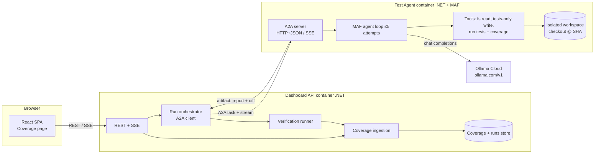

# /opsx:propose add-coverage-dashboard-and-test-agent

> Paste everything below the line into Claude Code after `/opsx:propose add-coverage-dashboard-and-test-agent`.
> Section "Recommended additions" is optional: delete the items you don't want before running.

---

## Context

Project: **maf-lab**. Backend is .NET (latest stable) with **Microsoft Agent Framework (MAF) for C#**; frontend is **React + TypeScript + Vite**, with **React Query** for server state, **React Router** for routing and **Vitest** for tests. Everything runs in **Docker**. The workflow is spec-driven (OpenSpec + Claude Code). Before writing artifacts, explore the existing repo (solution layout, API conventions, FE routing and the dashboard page, docker-compose) and align with what exists. Do not invent parallel conventions.

We want a **Coverage** section on the dashboard. It visualises test coverage of this repository. It also lets the user raise a coverage threshold for a file and delegate writing the missing tests to an **internal test-generation agent**. The agent runs in its own container and is reached **only via the A2A protocol**.

## Goal

1. Show the source tree with a coverage % per file (and aggregated per folder).
2. Clicking a file shows its full source with covered, uncovered and partially covered lines highlighted.
3. The user can view and change the file's coverage threshold. Raising it requires confirmation, then choosing an Ollama Cloud model, then starting an agent run.
4. The agent loops (generate tests → run → measure) until the file's coverage ≥ threshold or **5 attempts** are used.
5. On completion the agent returns a structured report. The file's coverage in the dashboard is updated from the new tests.

## Capabilities (create one delta spec per capability)

### 1. `coverage-dashboard`
- Coverage page reachable from the existing dashboard navigation (React Router route, e.g. `/dashboard/coverage`).
- Tree view of source files (backend C# + frontend TS). Each node shows line coverage %. Folders show aggregated %. Files below their threshold are visually flagged.
- Sorting and filtering: by name and by coverage; a "below threshold only" toggle.
- File view: full source with per-line status `covered | uncovered | partial` (partial = branch partially covered), with hit counts on hover. Include a summary header (lines, branches, %, threshold, last updated, source commit).
- Data comes from the backend API via React Query. Loading, empty ("no coverage report yet") and error states are required.
- Large files must render without freezing the UI (virtualised lines).

### 2. `coverage-ingestion`
- Backend ingests coverage reports and normalises them into one internal model (file → lines → hits, branches).
- Sources: .NET via coverlet (`XPlat Code Coverage`, Cobertura XML); frontend via Vitest coverage (v8/istanbul with Cobertura reporter). Paths are normalised to repo-relative.
- Every snapshot is stored with commit SHA and timestamp. The dashboard shows the latest snapshot per file.
- API endpoints (follow existing API conventions): tree with aggregates, file detail (source + line statuses), snapshot history for a file.

### 3. `coverage-threshold`
- There is a global default threshold, and each file may have an optional override. The UI shows the effective threshold.
- Lowering or keeping the value saves immediately (no agent).
- Raising the value above the file's current coverage opens a confirmation dialog. It states the current %, the target % and that an agent run will be started. After confirmation, the user must select a model before a run can start. Cancelling at any step leaves the threshold unchanged.
- Raising the value while the file's coverage already meets the new value just saves it (no agent).
- Only one active agent run per file. While a run is active, the threshold control for that file is locked and shows run status.

### 4. `model-selection`
- The model list comes from backend configuration: an allowlist of Ollama Cloud models with display name, tag and price per 1M input/output tokens. Initial allowlist: `glm-5.3:cloud` (default, recommended), `kimi-k3:cloud`, `glm-5.3-flash:cloud`, `deepseek-v4-pro:cloud`, `deepseek-v4.1-flash:cloud`.
- The picker shows name, price and a short "best for" note. Exactly one model must be selected to start.
- The backend validates the chosen model against the allowlist. The FE is not trusted.

### 5. `test-generation-agent`
- A separate .NET service/container, built with MAF (C#) and exposed as an **A2A server** (MAF A2A hosting: `AddA2AServer` + `MapA2AHttpJson`, agent card via `MapWellKnownAgentCard`).
- The LLM is Ollama Cloud through its OpenAI-compatible endpoint (`https://ollama.com/v1`). The API key is taken from a secret/env, never from the request. The model is taken from the task input (already validated).
- Input: repo ref (commit SHA), target file path, target coverage %, max attempts (5), model, language/toolchain (dotnet | vitest).
- It works in an isolated workspace: a clean checkout/worktree at the given SHA inside the container.
- **Attempt** = one cycle of: generate or modify tests → build → run the relevant test project/suite with coverage → parse coverage for the target file → compare with target. Feedback (compiler errors, failing tests, still-uncovered line ranges) is fed into the next attempt.
- Tools exposed to the agent (MAF function tools): read file, list files, write/modify files **only under test directories**, run tests with coverage, read coverage for a file. Tools must enforce the path allowlist; production code is read-only.
- Stop conditions: target reached → `completed`; 5 attempts exhausted → `completed` with `goalReached=false`; unrecoverable error → `failed`; cancel request → `canceled`.
- Guardrails: tests must not be skipped or focused (`.skip`, `.only`, `[Fact(Skip=...)]`), there must be no assertion-free tests, and no test may pass by catching the exception it is meant to verify.
- Output (A2A artifact, JSON): per-attempt log (coverage before/after, tests added, errors), final coverage, `goalReached`, tokens used and estimated cost, and a unified diff of the test changes.

### 6. `a2a-integration`
- The dashboard backend is the **A2A client** (MAF `A2AAgent` / A2A SDK). The browser never talks to the agent directly.
- The run is modelled as a long-running A2A task (background responses + continuation token). Task states map to UI states: `submitted → working → completed | failed | canceled`.
- The backend subscribes to task updates (streaming, with reconnection fallback to polling `GetTask`), persists them and relays them to the FE via SSE (or SignalR if already used in the repo). Updates include the current attempt n/5 and the latest coverage %.
- The user can cancel a run from the UI (A2A cancel task).
- On completion the backend applies the diff, independently re-runs the tests with coverage (it does not trust the coverage numbers reported by the agent), ingests the new snapshot and updates the file's coverage. If verification fails, the run is marked `verification_failed` and coverage is not updated.

## Non-goals
- Generating tests for code outside this repository.
- Modifying production code to make it more testable.
- Multi-user roles/permissions beyond what the app already has.
- Local (non-cloud) Ollama models in this change.

## Architecture (put into design.md)

Sequence: raise threshold → confirm → pick model → `POST /runs` → orchestrator creates the A2A task → stream updates → SSE to FE → artifact → apply diff + verify → new snapshot → FE invalidates React Query cache for tree and file.

## Recommended additions (optional; delete what you don't want)
- [ ] **Branch/PR output**: the agent's diff lands on a branch `test-agent/<file>-<runId>`. The dashboard shows the diff and "Accept" merges or opens a PR. Coverage is shown as *candidate* until accepted.
- [ ] **Mutation-score gate**: after coverage is reached, run Stryker.NET / StrykerJS on the target file and include the mutation score in the report. Optionally require a minimum score.
- [ ] **Cost estimate and budget**: show the estimated cost before start, apply a hard token/cost cap per run and show actual cost in the report.
- [ ] **Model escalation ("auto")**: attempts 1–3 on a flash model and 4–5 on `glm-5.3:cloud`.
- [ ] **Batch mode**: start runs for a folder or for all files below threshold, using a queue with a concurrency limit.
- [ ] **Run history and model scorecard**: per model, track success rate, attempts to goal, cost per +1% coverage and mutation score, built from stored runs.
- [ ] **Observability**: OpenTelemetry traces across FE → API → A2A → agent → LLM calls (MAF has built-in OTel support).

## Constraints for the artifacts
- Delta specs use `## ADDED Requirements`, `### Requirement:` with SHALL/MUST, and `#### Scenario:` with WHEN/THEN. Cover the happy path plus: threshold lowered, confirmation cancelled, model not in allowlist, run already active, goal not reached after 5 attempts, agent unreachable, cancel mid-run, verification failure.
- design.md: container topology, A2A task/artifact schema (JSON), agent tool contracts, path-allowlist enforcement, secrets handling, docker-compose changes, and the decision on SSE vs SignalR.
- tasks.md: small, ordered and verifiable tasks, grouped by backend ingestion → API → FE tree/file view → threshold + model picker → agent service → A2A wiring → verification → docker-compose → tests (xUnit for .NET, Vitest + React Testing Library for FE, one end-to-end run against a fixture file).
- List open questions in proposal.md instead of guessing (e.g. where coverage reports come from initially: CI artifact vs on-demand run).
