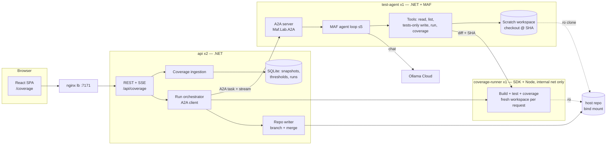

# Design

## Context

For the motivation, see proposal.md (Why). The approach is shaped by what the repo already does:

- **A2A.** `src/Maf.Lab.A2A` is the shared server library, used by the api and `Maf.Lab.ComplianceAgent`.
  - It maps the card at `/.well-known/agent-card.json` with `MapA2ASurface`.
  - It maps the protocol at `/a2a` (JSON-RPC and HTTP+JSON) with `MapA2AProtocol`, behind the `a2a-partner` policy.
  - It issues dev client-credential tokens from `/a2a/token`, as HS256 JWTs with an audience per agent.
  - It uses custom task stores: SQLite in the api, Redis in compliance.
  - DECISIONS §23 rejected the Agent Framework hosting bridge (`AddA2AServer` and related). The reason: its handler
    was internal, and an `AIAgent` cannot express `rejected` or `input-required`.
- **Existing A2A client.** `src/Maf.Lab.Api/A2A/ComplianceConsultant.cs`:
  - fetches a token, then the card by its full path;
  - calls the SDK `A2AClient` with streaming under a deadline;
  - audits each call as `a2a.consult`.
- **Chat models.** Models are reached through `IChatClientFactory.CreateChatClient(model)` in
  `src/Maf.Lab.Retrieval/Models/ModelProviders.cs`. It uses OllamaSharp against the native `https://ollama.com` API,
  with a bearer token from `OLLAMA_API_KEY`, and fails fast when the key is missing.
- **Tests.** Tests run on Microsoft.Testing.Platform (`global.json` `test.runner`). There is no coverage tooling at
  all, and Vitest has no coverage provider.
- **Persistence.** SQLite through EF Core `MafDbContext`, with the schema managed additively by `DatabaseInitializer`
  (no migrations). The database file is shared by both api replicas. Redis holds run state and locks
  (DECISIONS §17, §31).
- **Streaming.** SSE is `TypedResults.ServerSentEvents`. The web reads it with `fetch` and `SseParser`. SignalR is not
  used anywhere.
- **Web app.** It has no `/dashboard`. Stats screens are top-level routes in `LINKS` (`web/src/components/Layout.tsx`),
  and admin screens are wrapped in `RequireAdmin`.
- **Topology.** A new service must appear in `TopologyOptions`, `TopologyProbe` and `docs/topology.drawio`, or
  `TopologyTests` fail.

## Goals / Non-Goals

**Goals:**

- Model-written code runs only in a container that has no secrets and no egress.
- Nothing the agent says is trusted. Paths, guardrails and coverage are all re-established by the api and the runner.
- A run survives stream drops and api replica restarts.
- The work reuses the existing A2A library, auth, audit, SSE, SQLite and telemetry conventions. It does not introduce
  parallel ones.

**Non-Goals:**

- Reproducible coverage across machines. Coverage is measured inside the runner image only.
- Running integration tests (the Testcontainers ones) in the runner.
- A queue or batch of runs. By default the runner allows 1 concurrent build, and runs queue behind each other.

## Decisions

### D1. Topology: three participants, not two



The brief put the toolchain inside the agent container. That does not work here. The agent container must hold
`OLLAMA_API_KEY` and reach the internet, and tests written by the model would run in the same place. A generated test
could read the key and send it out. The build and test step therefore moves into `coverage-runner`, which is on an
`internal: true` compose network and holds no provider key. The agent keeps a scratch checkout for reading and for
staging its edits. It sends the runner a commit SHA plus a diff.

The api uses the same runner for verification. The verification is still independent: the api starts its own request
in a fresh workspace and ignores the numbers in the agent's report.

- **Alternative:** give the api image an SDK and run verification in the api. Rejected. It bloats the api image, and
  model-written code would run next to `Auth__SigningKey` and `JEV_MAF_LAB`.

### D2. A2A server: the existing `Maf.Lab.A2A` library, with a MAF agent inside

`Maf.Lab.TestAgent` follows `Maf.Lab.ComplianceAgent`:

- a Web SDK project that calls `MapA2ASurface` and `MapA2AProtocol`;
- an `IAgentHandler` (`TestGenerationHandler`);
- `RedisTaskStore` and `RedisPushConfigStore` for its tasks;
- `UsePathBase` from `A2A:PathBase`.

The handler runs a `ChatClientAgent` (Microsoft.Agents.AI) with `AIFunction` tools. The agent loop itself stays in C#
(see D5). The brief's `AddA2AServer` / `MapA2AHttpJson` / `MapWellKnownAgentCard` would be a second, parallel hosting
convention, and DECISIONS §23 records why it was rejected.

The local package cache now shows `Microsoft.Agents.AI.Hosting.A2A 1.22.0-preview` with public-looking `AddA2AServer`
overloads. Task 5.1 checks whether that invalidates §23. If it does, adopting the package is a separate change for
both agents, recorded in DECISIONS. It is not done ad hoc for one agent.

### D3. A2A client: MAF `A2AAgent` for the run, SDK client for cancel and get

Following the memory rule to prefer `Microsoft.Agents.AI.*`, the orchestrator uses the Agent Framework `A2AAgent`
(`Microsoft.Agents.AI.A2A`, already pinned, and used through `GetAIAgentAsync` in `tools/Maf.Lab.A2AProbe`). It runs
with background responses, persisting the continuation token (the task id) on the run row. If `A2AAgent` does not
expose `tasks/resubscribe`, `tasks/get` or `tasks/cancel`, the orchestrator uses the same `A2AClient` the
`ComplianceConsultant` uses for those operations, and the gap is recorded in DECISIONS §23. Token acquisition, card
resolution by full path, and `ToolAudit` records (`a2a.testgen.start|follow|cancel`) reuse the consultant's helpers.

Options: `TestAgent:` section with BaseUrl, ClientId, ClientSecret, `RunDeadline` (default 45 min) and
`CardCacheFor`.

### D4. Task and artifact schema

The task is sent as a message with one data part:

```json
{
  "kind": "testgen.request/v1",
  "runId": "r_01J…",
  "commit": "73fdb9a…40 hex",
  "targetFile": "src/Maf.Lab.Api/Coverage/CoverageTree.cs",
  "toolchain": "dotnet",
  "targetLinePct": 85,
  "maxAttempts": 5,
  "model": "glm-5.3:cloud",
  "budget": { "maxTokens": 400000, "maxCostUsd": 1.50 }
}
```

Progress arrives as status updates (`working`) whose message carries one data part:

```json
{ "kind": "testgen.progress/v1", "attempt": 2, "maxAttempts": 5,
  "phase": "generating|building|testing|measuring",
  "lastLinePct": 71.4, "tokens": 91234, "costUsd": 0.31 }
```

The final artifact, `name: "testgen-report"`, has one data part and is attached before `completed`:

```json
{
  "kind": "testgen.report/v1",
  "goalReached": false,
  "stopReason": "target|attempts|budget|error|canceled",
  "target": 85, "baseline": 62.0, "final": 79.3,
  "attempts": [
    { "n": 1, "before": 62.0, "after": 70.1,
      "build": "ok|failed", "tests": { "passed": 212, "failed": 0, "skipped": 0 },
      "testsAdded": ["CoverageTreeTests.Aggregates_are_line_weighted"],
      "errors": ["CS0246 …"], "guardrailViolations": [],
      "uncovered": [[40, 44], [71, 71]] }
  ],
  "usage": { "inputTokens": 280100, "outputTokens": 31200, "estimatedCostUsd": 0.94 },
  "diff": "diff --git a/tests/Maf.Lab.Tests/… (unified)"
}
```

The diff is inline. With a size cap of 256 KB it stays well under the 1 MB body limit, and a larger diff fails the task
with `diff_too_large`. Ending states: `completed`, `failed` (with a status message code such as `model_unavailable`,
`checkout_failed`, `runner_unavailable` or `diff_too_large`), or `canceled`. `input-required` and `rejected` are
never used, except that `rejected` answers invalid input.

The agent card has one skill, `generate-tests`, described as "for: raising line coverage of one file in this repo;
not for: production code changes, other repositories".

### D5. The agent loop is code; the model writes tests

`TestGenerationHandler` owns the loop:

```
for n in 1..maxAttempts:
    if budget would be exceeded by the estimate → stop(budget)
    one agent run (ChatClientAgent, max ~12 tool calls)
    guardrails(scratch diff)
    runner.run(commit, diff, target)
    record the attempt; publish progress
    if pct ≥ target and build ok and all tests pass → stop(target)
    feedback = errors + failures + violations + uncovered
```

The model does not decide when to stop, so it cannot be talked out of the 5-attempt cap or the budget. The chat client
comes from `IChatClientFactory.CreateChatClient(model)`. The brief's OpenAI-compatible `https://ollama.com/v1` would be
a second client path, so the existing native Ollama client is reused instead. Its `UsageDetails` provide the token
counts. Thinking is disabled, as in DECISIONS §9.

### D6. Tool contracts

Every tool returns a DTO designed for the model, never an entity, and every error is a short text with no host paths.

| Tool | Input | Output |
|---|---|---|
| `read_file` | `path` | `{ path, lines: int, text }`, capped at 2 000 lines, with a `truncated` flag |
| `list_files` | `dir`, `glob?` | `{ entries: [{ path, kind }] }`, capped at 500 |
| `write_file` | `path`, `content` | `{ path, created: bool, bytes }` or a refusal |
| `run_tests` | none (uses the scratch diff) | `{ build, diagnostics[≤30], tests{passed,failed,skipped}, failures[≤20]{name,message}, targetPct, uncovered[[from,to]] }` |
| `read_coverage` | `path` | `{ path, pct, uncovered[[from,to]] }` from the last run |

`run_tests` counts toward nothing by itself. Only the loop's own measured run ends an attempt, so the model can
check its work mid-attempt at the cost of runner time. It is capped at 2 calls per attempt.

### D7. Path allowlist enforcement

The allowlist is enforced in one place (`WorkspacePaths.Resolve(path, access)`), in both the agent and the api:

1. Reject absolute paths, drive letters, NUL bytes, and backslashes.
2. Combine with the workspace root and `Path.GetFullPath`. Require the result to stay under the root.
3. Walk each existing segment and reject any symlink (`FileSystemInfo.LinkTarget != null`).
4. For writes, match the repo-relative path against the allowlist:
   - `dotnet`: `tests/**/*.cs`, excluding `tests/**/bin/**` and `tests/**/obj/**`;
   - `vitest`: `web/src/**/*.test.ts`, `web/src/**/*.test.tsx` and `web/src/test/**`.
5. Reads are allowed anywhere under the root except `.git/`, `**/appsettings*.json` with secrets, and `.env*`.

The api re-runs step 4 on every path in the returned diff, parsing the `diff --git` headers and checking both sides
of any rename. The runner applies diffs with `git apply --check` first, then `git apply`, run as a non-root user in a
workspace owned by that user.

### D8. Guardrails are static checks in code

`TestGuardrails.Check(diff, toolchain)` runs in the agent after each attempt and again in the api before
verification.

- **C#** uses Roslyn syntax trees:
  - flags `[Fact(Skip=…)]` and `[Theory(Skip=…)]`;
  - flags test methods with no call to `Assert.*`, `Should*`, `Verify*` or `Record.Exception` followed by an assert;
  - flags `try { … } catch (X) { }` where the `catch` swallows the exception in a test body with no rethrow and no
    assert inside the `catch`.
- **TS** uses the TypeScript compiler API (run in the runner image with `node`):
  - flags `.skip`, `.only`, `xit`, `fit`, `xdescribe` and `fdescribe`;
  - flags `it` and `test` bodies with no `expect(`;
  - flags a `try`/`catch` without `expect` in the `catch`.

These checks are deterministic, so Jev is not used (see proposal, Impact). The model sees violations as feedback.

### D9. Coverage tooling

- **.NET.** Add `Microsoft.Testing.Extensions.CodeCoverage` to `tests/Maf.Lab.Tests`, and run
  `dotnet test --project tests/Maf.Lab.Tests -- --coverage --coverage-output-format cobertura --coverage-output <nonce>/dotnet.cobertura.xml`.
  The brief's coverlet `XPlat Code Coverage` is a VSTest data collector, and this repo runs on Microsoft.Testing.Platform,
  so it would not attach. `coverlet.MTP` was considered; the Microsoft extension ships alongside the Test.Sdk already
  pinned and needs no runsettings. A `.runsettings`-equivalent config includes `src/**` modules only.
- **Web.** Add `@vitest/coverage-v8` and configure `test.coverage` in `web/vite.config.ts`: `provider: 'v8'`,
  `reporter: ['cobertura', 'text-summary']`, `include: ['src/**/*.{ts,tsx}']`, and `exclude` test files and `src/test`.
- **Partial lines.** Cobertura's `branch="true" condition-coverage="50% (1/2)"` becomes `partial` when
  `0 < covered < total` and `hits > 0`.
- **Nonce output path.** The runner writes coverage to a random directory it does not reveal to test code, and reads
  only the file it created after the test process exits. This makes forging the report from a test harder; see Risks.

### D10. Storage (SQLite, additive)

New tables are created by `DatabaseInitializer`. None of them has a `firm_id`, because they describe the repository.

- `CoverageSnapshots(Id, CommitSha, Dirty, Toolchain, Kind[official|candidate], RunId?, CreatedAt)`
- `CoverageFiles(SnapshotId, Path, LinesTotal, LinesCovered, BranchesTotal, BranchesCovered)` with index
  `(Path, SnapshotId)`
- `CoverageLines(SnapshotId, Path, Line, Hits, BranchesCovered, BranchesTotal)`, stored as one compressed JSON blob
  per file row, so ingesting one report does not insert tens of thousands of rows
- `CoverageThresholds(Path PK, Pct, UpdatedAt, UpdatedBy)`, where the default comes from
  `Coverage:DefaultThresholdPct` (80)
- `TestGenRuns(Id, Path, Toolchain, Commit, TargetPct, Model, TaskId, State, Reason?, Attempt, LastPct, Tokens,
  CostUsd, Branch?, MergeCommit?, CreatedAt, UpdatedAt, CreatedBy)`, with a unique partial index on `Path` where
  `State` is non-final
- `TestGenRunEvents(RunId, Seq, At, Json)`, used for SSE replay

The unique partial index enforces "one active run per file" across both replicas. The ownership of the follower for
each run is a Redis lease (`testgen:follow:{runId}`, 30 s TTL, renewed). A replica that starts up takes over leases
that have expired.

### D11. SSE, not SignalR

`GET /api/coverage/runs/{id}/events` uses `TypedResults.ServerSentEvents`, following the chat endpoint. The web reads
it with the existing `SseParser`. The stream sends a `snapshot` event first, then `progress` and `state` events, and
closes on a final state. Both replicas can serve it: events are read from `TestGenRunEvents`, which the follower
writes, and delivered through Redis pub/sub `testgen:run:{id}` with a 2 s poll fallback. SignalR was not chosen: it
is not in the repo, the flow is one-way, and the lb already passes SSE unbuffered on `/api/`.

### D12. Repo writer (branch and merge)

The api image gains `git`. Compose bind-mounts the repo at the same absolute path it has on the host
(`${MAF_LAB_REPO}:${MAF_LAB_REPO}`), because `.git/worktrees/*/gitdir` records host paths. The mount is read-write
for the api only. Writes are serialised by a Redis lock `testgen:git`.

- **Branch.** `git worktree add --detach <tmp> <commit>`, then `git apply`, then a commit authored as
  `maf-lab test-agent`, then `git branch test-agent/<slug>-<runId>`, then remove the worktree. The user's checkout is
  never touched. The slug is the path with `/` and `.` replaced by `-`, capped at 60 characters.
- **Accept.**
  - Refuse if `git worktree list --porcelain` shows `main` checked out and `git -C <that worktree> status --porcelain`
    is non-empty.
  - If `main` is checked out in a clean worktree, run `git -C <wt> merge --no-ff --no-edit <branch>`. On conflict,
    run `merge --abort` and refuse.
  - Otherwise, use `git merge-tree --write-tree main <branch>`, then `commit-tree`, then
    `update-ref refs/heads/main <new> <old>`. If the CAS fails, retry once.
  - After a successful merge, promote the candidate snapshot to `official` with `CommitSha = merge commit`.

### D13. Cost estimate and budget

- **Estimate.** For each attempt: `tokens ≈ (targetFileTokens + relatedFilesTokens + 6k system/tools) × 1.6 input +
  4k output`, times the remaining attempts, priced at the allowlist rates. File tokens are estimated as bytes ÷ 4.
- **Budget.** It comes from `TestAgent:Budget` (default 400k tokens and $2). The agent stops before an attempt whose
  estimate would cross the cap, and also stops mid-attempt if actual usage crosses it (`stopReason: budget`).
- **Actual cost.** It comes from `UsageDetails` at the configured prices and is labelled an estimate while the prices
  are.

### D14. Model allowlist and availability

`TestAgent:Models` is an array of `{ Tag, DisplayName, InputPerMTok, OutputPerMTok, BestFor, Default,
PriceIsEstimate }`. Availability is checked by a 1-token chat call per model with a fixed probe string that contains
no repository content. The result is cached for 10 minutes in Redis. A provider refusal ("not included in your
plan", 401, 403 or 404) marks the model unavailable. The same check is repeated at start. This is a new model use
authorised by the brief. The chat model `gpt-oss:120b` and its configuration are not touched.

### D15. Web

- **Structure.** A new `web/src/coverage/` folder with:
  - `CoveragePage` (route `/coverage`, added to `LINKS`);
  - `CoverageTree`, which flattens the tree and virtualises it when there are more than 500 visible rows;
  - `FileView`;
  - `ThresholdControl`, `RaiseThresholdDialog` and `ModelPicker`;
  - `useRunEvents` (SSE through `SseParser`).
- **Queries.** React Query keys are `['coverage','tree']`, `['coverage','file',path]`,
  `['coverage','history',path]`, `['coverage','models']` and `['coverage','runs',path]`. A final-state event
  invalidates the tree, file and runs keys.
- **Virtualisation.** A small in-house windowing hook (fixed line height, overscan 30) instead of a new dependency,
  since only the file view needs it. `react-window` is the fallback if the hook turns out to be insufficient, and is
  recorded in DECISIONS.
- **Admin gating.** Admin controls render only when `useAuth().isAdmin`. The server enforces `AuthPolicies.FirmAdmin`
  regardless.
- **Confirmation.** The raise confirmation is a modal dialog, as `openspec/project.md` asks for write confirmations in
  the UI. `write-confirmation-ui`'s in-place card rule applies to chat writes proposed by the model. This write is
  initiated by the user from a form, so it does not apply.

### D16. API surface (`/api/coverage`, `RequireAuthorization()`; writes use `FirmAdmin`)

| Method | Path | Notes |
|---|---|---|
| GET | `/tree` | files and folders, aggregates, thresholds, candidate, active run |
| GET | `/files?path=` | source at the snapshot commit (`git show`), lines, summary |
| GET | `/files/history?path=` | snapshots, newest first |
| PUT | `/thresholds?path=` | `{ pct \| null }`. Returns `{ saved }` or `409 run_required { currentPct }` when raising above coverage |
| GET | `/models` | allowlist with availability and estimate inputs |
| POST | `/runs` | `{ path, pct, model }`. Saves the threshold and creates the run in one transaction after the task is accepted; `409` if a run is active; `422` for an invalid model; `503 agent_unavailable` |
| GET | `/runs?path=` · `/runs/{id}` | run state |
| GET | `/runs/{id}/events` | SSE |
| POST | `/runs/{id}/cancel` · `/accept` · `/discard` | admin |
| POST | `/refresh` | admin. Runs both toolchains at `main` and returns the in-progress refresh if one is running |
| POST | `/reports` | admin. Multipart Cobertura upload with `commit` and `toolchain` |

Errors are `Results.Problem` with a stable `type` code and a short `detail`, as the existing endpoints return them.

### D17. Compose and topology

- **`test-agent`** (1 replica):
  - built from `src/Maf.Lab.TestAgent/Dockerfile` (aspnet 10 plus git);
  - receives `x-app-env` (which carries `OLLAMA_API_KEY`), `A2A__Audience=maf-lab-test-agent` and
    `A2A__Partners__maf-lab-assistant__Secret`;
  - mounts the repo read-only and has a `testagent-work` volume;
  - is on networks `default` and `runner`;
  - has a health check on `/health`.
- **`coverage-runner`** (1 replica):
  - built from `src/Maf.Lab.CoverageRunner/Dockerfile` (dotnet SDK 10.0.401 plus Node 24 plus git; the NuGet and npm
    caches are pre-seeded at image build from the repo's lockfiles, because the runtime has no network);
  - is on network `runner` only (`internal: true`);
  - mounts the repo read-only and has a `runner-work` tmpfs or volume;
  - receives only `Auth__SigningKey` for token checks. It does not receive `x-app-env`, and gets no
    `OLLAMA_API_KEY`, `JEV_MAF_LAB` or Telemetry endpoint;
  - runs as a non-root user.
- **Api.** It joins the `runner` network, mounts the repo read-write, and gets `TestAgent__*`.
- **lb.** The lb gets no new route, because both new services are internal-only.
- **Runner telemetry.** The runner has no egress, so it exports OTLP to the collector only if the collector is on the
  `runner` network. The collector joins `runner`, which keeps D1's "no internet" and still gives one trace.
- **Topology.** `TopologyOptions` gains `TestAgent` and `CoverageRunner`. `TopologyProbe` gains the ids `test-agent`
  and `coverage-runner` with probes on `/health`, and the edges api→test-agent, test-agent→coverage-runner,
  api→coverage-runner and test-agent→chat-provider. `docs/topology.drawio` gains two boxes without overlap.
- **CI.** `docker-compose.ci.yml` points the test agent at the Ollama stub, which gains a scripted "write a test"
  answer for the end-to-end fixture.

### D18. Telemetry

Both new services call `builder.AddLabTelemetry("maf-lab-test-agent" | "maf-lab-coverage-runner")`. Trace context
propagates as follows:

- the api sets `traceparent` on the A2A HTTP calls, as the existing HttpClient instrumentation does;
- the handler starts its activity from the incoming context;
- runner calls carry it onward;
- model calls are traced by the chat client's existing instrumentation.

Spans are named `testgen.run`, `testgen.attempt` (attributes `attempt`, `pct`, `tokens`, `cost`) and `runner.run`
(attributes `toolchain`, `build`, `tests.*`, `duration`). Prompts, source text and diffs are never recorded.

### D19. Suspected bugs: skip, prove, file an issue

- **Agent side.** The instructions tell the model to assert intended behaviour: what the names, documentation, specs
  and callers say. When a test fails on the production code rather than on itself, the model keeps the assertion and
  marks the test skipped:
  - C#: `[Fact(Skip = "suspected-bug: <title>")]`;
  - TS: `it.skip(…)` with `// suspected-bug: <title>` on the line before it.

  It then calls `report_suspected_bug(testFile, test, title, description, expected, actual, failure)`, a sixth tool.
  `TestGuardrails.Check(files, allowedSkips)` allows exactly those skips. Any other skip, or more than 3 suspected
  bugs, is a violation. A suspected-bug test still needs an assertion. A new guardrail flags file writes, moves and
  deletes (C#: `File.*`/`Directory.*`; TS: `fs.*`) whose arguments name `src/` or `web/src/`: tests never change the
  code they test. The report gains `suspectedBugs[]`.
- **Api side (in `RunVerifier`, before the full verification run).**
  1. Every skip in the diff must be a listed suspected bug.
  2. For each suspected bug, the runner runs the diff with that one skip removed (`targetFile` unset) and must report
     that test as failed. If the test passes, the run is `verification_failed` with `suspected bug not reproduced`.
  3. For each confirmed bug, look up `TestGenIssues(RunId, TestId)`. If there is no row, create the issue through the
     GitHub REST API (`POST /repos/{owner}/{repo}/issues`, labels `test-agent`, `suspected-bug`) and store its number
     and URL. The row is inserted with a `creating` state first and completed after the call, so a restart in between
     sees `creating` and searches the repository's open issues for the run-and-test marker in the body before
     creating again.
  4. Rewrite the diff's marker from `suspected-bug: <title>` to `suspected-bug <issue-url>: <title>`, or to
     `suspected-bug (no issue: GitHub not configured): <title>`, then continue with the normal verification and the
     branch.
- **GitHub client.** `GitHubIssues` is a typed HttpClient on `https://api.github.com` with bearer
  `GITHUB_ISSUES_TOKEN`, read from the environment by the api only. The repository comes from `GitHub:Repository`
  (default: parsed from `git remote get-url origin`). No other GitHub operation is used: create, comment, close.
- **Accept and Discard.** Accept comments on each issue with the merge commit and leaves it open. Discard closes each
  issue with a comment. A GitHub failure in either is logged and shown, and never blocks the merge or the discard.
- **UI.** The run's report lists its suspected bugs with issue links, in the candidate panel (task 8.4).
- **Why not have the agent create issues?** It would need the GitHub credential next to model-driven code, and a
  test that was simply wrong would leave a false issue behind. The api creates an issue only after its own run shows
  the failure. A person then owns what follows (human in the loop).

## Risks / Trade-offs

- **The account may not serve the allowlisted models.** DECISIONS §9 found only `gpt-oss:120b` usable on this tier.
  → The availability check shows this up front. The proposal lists it as an open question. The feature works with
  any allowlist entry that the account serves.
- **Generated tests could forge the coverage report.** → The output path is a nonce, the report is read only after
  the process exits, the api checks guardrails, and verification runs in a fresh workspace. The remaining risk is
  accepted for a lab. The diff is also reviewable on the branch before Accept.
- **Merging into a checked-out `main` behind another agent's back.** → The merge is refused when that checkout is
  dirty, the ref update is compare-and-swap, and all writes go through one lock. The residual race (the user starts
  editing between the check and the merge) is accepted. In that case `git merge` itself refuses on overlapping files.
- **The runner has no network, so a lockfile change breaks restore.** → Restore runs at image build. The runner image
  is rebuilt by `make` when `Directory.Packages.props` or `web/package-lock.json` changes (a make dependency). A
  restore failure is reported as `runner_restore_failed`, not as a failing test.
- **Full unit test project per attempt is slow (minutes).** → An attempt budget of about 5 minutes and one runner
  build at a time are accepted. `run_tests` inside an attempt is capped at 2 calls.
- **The model bends an assertion to the bug instead of reporting it.** Code cannot see that; the instructions forbid
  it, and the candidate diff is reviewed before Accept. → Accepted risk, stated rather than hidden.
- **A flaky test is reported as a bug.** The un-skipped test must fail in the api's own run; a test that passes there
  fails verification and creates no issue. → A flaky test can still fail by chance once; the issue says it came from
  one run, and a person closes it.
- **Host paths in the bind mount (`MAF_LAB_REPO`).** → `make` exports it, and `make doctor` checks it points at a git
  repository.
- **File ownership from container writes.** → The api's git commands run as the host UID and GID, passed by `make`.

## Migration Plan

This change is purely additive: new tables, new services, new routes and a new nav link. Rollback is to remove the
two services from compose and the nav link; the tables stay unused. Branches `test-agent/*` that were never accepted
can be deleted by hand.

## Open Questions

- Should candidate branches that were never accepted be cleaned up automatically after N days? This does not change
  specs or tasks now.
